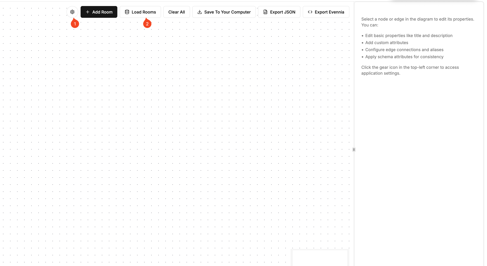

# Evennia Room Builder

This is a react based room builder for Evennia.

# Installation & Usage

## WARNINGS

- Currently the editor is not optimized for mobile devices.
- The editor is not optimized for large maps.
- The editor API isn't secure. So I'd only use this on a local server for now.
- Currently it only searches form rooms that are from the typeclass `Room` (in `typeclasses/rooms.py`). Since Evennia dynamically loads typeclasses, this means that if you add a new room type, need to modify the `editor_api.py` file to support it.

## Installation

1. Download the zip file from the latest release
2. Extract the zip file. You should see a directory structure like this:

```
├── 404.html
├── _next
│   ├── SOME_HASH
│   └── static/

├── index.html
├── index.txt
└── python
    ├── editor.py
    ├── editor_api.py
    └── urls.py
```

3. This tool requires that `django-shinobi` is installed in your Evennia game. To do this you can run the following command:

```
pip install django-shinobi
```

4.  Copy the following python files to your Evennia game:

```
editor.py -> /web/website/editor.py
editor_api.py -> /web/website/editor_api.py
urls.py # This is an example of how to set up the urls for the editor. You'll need to change it to match your own urls.
```

5. Copy the following javascript/html/css files to your Evennia game:

```
index.html -> web/templates/website/editor.html
_next/ -> web/static/website/_next/
```

6. Reload your Evennia server by running `evennia reload`
7. While logged in as a superuser or a user with the Builder permission, navigate to the editor page by going to the following url:

```
http://<your-evennia-server-ip>:8000/editor
```

8. You should see the room builder interface:



9. To connect the editor to your game you'll need to click on the settings icon indicated by the (1) in the image above. Then enter the following information:

```
http://<your-evennia-server-ip>:8000/editor-api/
```

10. To test that this works, you can create a new room by clicking on the "Create Room" button. You should then be able to `tel ROOM_NAME` to connect to the room.
